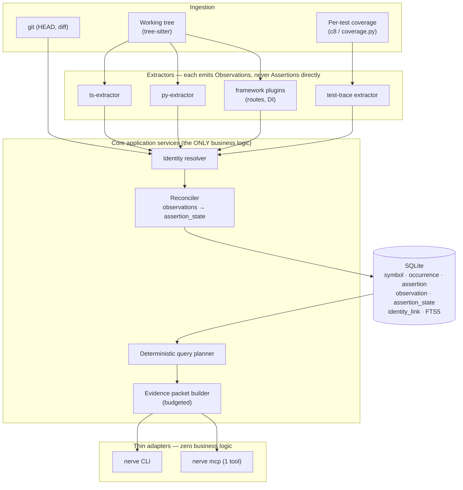

# Nerve — Architecture & Implementation Plan (Claude's independent position)

**Date:** 2026-07-31
**Status:** Debate document. Nothing implemented. No repository created.
**Purpose:** An independent, opinionated architecture to be compared against a separately-produced ChatGPT plan, then synthesized.

**Evidence labels used throughout:**
`[V]` verified by me from a primary source this session (GitHub API, raw LICENSE/package.json/schema files, PyPI JSON, npm registry, local filesystem).
`[VC]` vendor claim, read from the project's own README — repeated here but *not* independently reproduced.
`[P]` my own architectural proposal.
`[U]` open uncertainty.

---

## 18.1 Executive Summary

### Is it feasible?

The *engineering* is feasible. The **product as scoped in §10 of the brief is not viable**, because it has already been built and given away.

This is the single most important finding of my research, and it should reframe the whole project:

> The proposed MVP — TypeScript + Python, tree-sitter, SQLite/WAL/FTS5, stable symbol IDs, imports/defs/refs/calls/inheritance/routes, native file watcher, incremental invalidation, one primary MCP tool, first-class CLI, raw-source fallback, basic git-diff impact, a few framework plugins, benchmark harness — is a **near-exact description of CodeGraph v1.5.0, which is MIT-licensed, free, and shipping releases every ~10 days.** `[V]`

Verified specifics that collide with the proposed MVP, all from CodeGraph's own repo:

| Proposed MVP item | CodeGraph v1.5.0 status |
|---|---|
| SQLite + WAL + FTS5 | `[V]` `.codegraph/codegraph.db`; `schema.sql` has `nodes_fts` FTS5 external-content table + sync triggers |
| Tree-sitter extraction, TS + Python | `[V]` native **Rust kernel** with grammars compiled in, 20 languages, portable-engine fallback for the rest |
| Native file watcher + incremental invalidation | `[V]` FSEvents/inotify/ReadDirectoryChangesW, 2 s debounce (`CODEGRAPH_WATCH_DEBOUNCE_MS`, clamped 100 ms–60 s), **plus** a per-file staleness banner **plus** connect-time `(size, mtime)`+content-hash reconciliation |
| Stable symbol identity | `[V]` `nodes.id` / `qualified_name`, `unresolved_refs` table with a `pending`→`failed` retry lifecycle and `name_tail` re-matching |
| Routes / framework plugins | `[V]` `route` nodes for Django, Flask, FastAPI, Express, NestJS, Laravel, Drupal, Rails, Spring, Play, Gin/chi/gorilla/mux |
| One primary MCP tool | `[V]` `codegraph_explore` is the **only** tool listed by default; 7 others exist but are unlisted unless `CODEGRAPH_MCP_TOOLS` re-enables them |
| First-class CLI | `[V]` 18 commands incl. `index`, `sync`, `status`, `explore`, `impact`, `affected`, `unlock`, `daemon` |
| Git-diff impact / affected tests | `[V]` `codegraph impact <symbol>` **and** `codegraph affected [files...]` (test selection) already ship |
| Benchmark harness | `[V]` `__tests__/evaluation/runner.ts`, `npm run eval` |
| Provenance on edges | `[V]` `edges.provenance TEXT` column + `idx_edges_provenance` |

Building the §10 MVP therefore produces **a worse CodeGraph, 18 languages short, with no Rust kernel** — under a different name. That is the most likely way this project fails, and it is a *product* failure, not a technical one.

### Does it have meaningful differentiation?

Yes — but **only in §8, and only if §8 is narrowed drastically.**

Neither incumbent does evidence *reconciliation*. Verified gaps:

- **CodeGraph** `[V]`: no documentation ingestion, no runtime/test-execution evidence, no temporal/git-history layer, no cross-repository contracts, no confidence or evidence-class semantics. The `provenance` column is a bare string, not an evidence model. Indexes the working tree only.
- **GitNexus** `[V]`: has cross-repo contracts (`gitnexus://group/{name}/contracts`), Leiden communities, process traces, and opt-in CFG/PDG/taint (TS/JS only) — but no runtime or test evidence, no documentation reconciliation, no temporal graph. **And it is PolyForm-Noncommercial-1.0.0** `[V]`, which locks it out of every commercial engineering org.
- **Graphify** `[V]`: genuinely multimodal, Apache-2.0, but stores a NetworkX graph as `graph.json`, and its semantic layer is *LLM subagents writing JSON chunks* orchestrated by a Claude Code skill — non-deterministic, non-incremental at the semantic layer, and not separable from deterministic edges at query time.

### The strongest product insight

**Affected-test selection is the only capability in this entire product space that has objective ground truth.**

Everything else — "did the graph give a better answer?", "was the architecture summary correct?" — requires an LLM judge or a human panel, which is why every tool in this space benchmarks *tokens and tool calls* instead of correctness. CodeGraph's own benchmark is a clean illustration: `[V]` 7 repos, `claude -p` with Opus 4.8, `--strict-mcp-config`, 4 runs/arm, median — measuring **time, tool calls, tokens, cost, and nothing else.** Answer quality is never measured. On 3 of 7 repos the WITH-CodeGraph arm is actually *slower* in wall-clock (Excalidraw 36 s vs 23 s, OkHttp 27 s vs 30 s, Alamofire 49 s vs 31 s) `[V]`; the win is decisively in tokens/cost, not latency or correctness.

That is the opening. A system that can say *"these 12 tests can fail if you ship this diff, and here is why, and here is what I could not determine"* — and be **scored against reality** — is defensible in a way that "richer graph" never is.

### Recommended initial wedge

**Evidence-graded change risk for a single repository, powered by joining a static graph against per-test execution evidence.**

Concretely, the product answers one question extremely well:

> *"I am about to change X. What actually breaks, which tests really cover it, and where is my evidence weak?"*

The mechanism that makes this differentiated rather than incremental:

1. Ingest **per-test coverage** (`vitest --coverage` / `c8` / `coverage.py`, per-test granularity), not OpenTelemetry. Local, no PII, no sampling bias, no production access, no API keys.
2. Join observed execution against the static graph.
3. Emit three products from that join:
   - **Affected-test selection** with measured recall — scoreable against seeded faults.
   - **`STATIC_POSSIBLE` but never executed** — untested blast radius.
   - **Executed but absent from the static graph** — this is the important one. *Test execution automatically discovers the dynamic-dispatch, DI, and framework edges your tree-sitter resolver missed.* The runtime layer becomes a **validator and generator for the static layer**, and the graph measurably improves itself. I have not found this shipped anywhere. `[U]` — I searched the three incumbents' READMEs and CLI surfaces; I did not exhaustively search the wider ecosystem.

This wedge is narrow, locally verifiable, needs zero LLM calls, and — uniquely — **can be proven or disproven with a two-week experiment** (§18.17).

### Recommended MVP scope

TypeScript + Python only. Tree-sitter baseline. SQLite. Static graph + per-test coverage ingestion + the reconciliation join. Twelve CLI commands. One MCP tool. **Zero LLM calls. No documentation layer. No multi-repo. No git history. No OpenTelemetry. No memory layer.** Details in §18.12.

### Largest risks

- **Largest technical risk:** precision of inferred edges. Nobody in this space measures false-positive rate. CodeGraph publishes "fair coverage" per language `[V]` (TS/JS 95.8% — *measured on its own repo*; Python/psf-requests 100%; Rust/ripgrep 86.7%; C#/MediatR 85.2%) — but that metric is **file-level recall only and says nothing about precision.** An impact analysis with 20% phantom edges is worse than grep, because it is confidently wrong.
- **Largest product risk:** CodeGraph is MIT, free, good, and improving weekly `[V]` (v1.3.0 → v1.5.0 in 14 days). Nobody installs a second code-graph tool.
- **Largest licensing risk:** GitNexus is PolyForm-Noncommercial-1.0.0 `[V]`. Reading its *source* to guide implementation of a commercial product is the single most dangerous action available to this team. Hard rule in §18.15.
- **Most likely failure mode:** building §10 as written, shipping a worse CodeGraph, and discovering it 4 months in.
- **Clearest evidence to justify continuing:** the §18.17 experiment returns ≥5% missed-edge discovery *and* ≥50% test-suite reduction at 100% fault recall. If it returns <1% and no reduction advantage over "run tests whose files changed", the thesis is dead and you should stop.

---

## 18.2 Verified Competitive Analysis

All rows `[V]` unless marked. Metadata pulled from the GitHub API, npm registry, PyPI JSON, and raw `LICENSE`/`package.json`/`schema.sql` files on 2026-07-31.

| | **Graphify** | **GitNexus** | **CodeGraph** |
|---|---|---|---|
| Repo | `Graphify-Labs/graphify` | `abhigyanpatwari/GitNexus` | `colbymchenry/codegraph` |
| Stars / forks | 99,394 / 9,640 | 44,856 / 4,971 | 63,753 / 4,010 |
| Created / last push | 2026-04-03 / 2026-07-30 | 2025-08-02 / 2026-07-31 | 2026-01-18 / 2026-07-24 |
| Open issues | 720 | 281 | 380 |
| Version | PyPI `graphifyy` 0.9.31 | `gitnexus` 1.6.9 | `@colbymchenry/codegraph` 1.5.0 |
| **License** | **Apache-2.0** (default branch `v8`) | **PolyForm-Noncommercial-1.0.0** (raw LICENSE + `package.json`; GitHub reports `NOASSERTION` because PolyForm is not SPDX/OSI-detected) | **MIT** |
| Distribution | Python / PyPI + Claude Code skill | Node / npm, native + WASM | Node / npm, native Rust kernel |
| **Storage** | NetworkX in memory → `graphify-out/graph.json` | **LadybugDB** native (`@ladybugdb/core`), WASM in browser | **SQLite** `.codegraph/codegraph.db` + FTS5 |
| Parsing | tree-sitter (Python bindings) | tree-sitter native + WASM | tree-sitter compiled into a **Rust kernel** |
| Languages | many via tree-sitter extras (sql, hcl, pascal, dm, …) | 14 | 20 in kernel + portable fallback |
| Typed / compiler resolution | no | constructor inference, type annotations, `self`/`this` receiver resolution — still AST-level, not a typechecker | receiver-type inference via `nodes.return_type`; not a typechecker |
| Index freshness | `--update` incremental; `--watch` via `watchdog` | `analyze` re-run; staleness reported per repo/group | **3 layers**: OS watcher + 2 s debounce; per-file staleness banner; connect-time hash reconciliation |
| Dynamic analysis | LLM-inferred semantic edges | **CFG + PDG + taint**, opt-in `--pdg`, **TS/JS only**, off by default | framework route tables (11 frameworks); dynamic-dispatch hops `[VC]` |
| Documents | **PDF, docx, xlsx, images, audio/video (faster-whisper, yt-dlp)** | no | no |
| Runtime / test evidence | no | no | `codegraph affected` = *static* test selection, not observed execution |
| Multi-repo | merge N `graph.json` into a cross-repo graph | **global registry** `~/.gitnexus/registry.json`, lazy conns, 5-min eviction, max 5 concurrent; **group contracts** resource | `projectPath` arg lets one server query another indexed project |
| Temporal / git history | no | git-diff impact `[VC]` | no |
| CLI | `extract`, `query`, `path`, `explain`, `add`, `update`, exports | `analyze`, `mcp`, `serve`, `eval-server`, `list`, `status`, `clean`, `wiki` | 18 cmds incl. `impact`, `affected`, `daemon`, `unlock`, `telemetry` |
| MCP surface | `--mcp` stdio | many tools + **resources** (`gitnexus://…`) + 2 **prompts**; `maxTokens` budget; `GITNEXUS_MCP_READ_ONLY`; repo allowlist | **1 tool listed** (`codegraph_explore`), 7 unlisted behind env var |
| Visualization | **strongest**: HTML, SVG, GraphML, Neo4j/FalkorDB Cypher, Obsidian vault, wiki | web UI, bridge mode, mermaid via `generate_map` | none |
| Benchmarks | none published | `eval-server` exists; methodology not published in README | 7 repos, Opus 4.8, 4 runs/arm, median — **cost/tokens/tools/time only, no correctness** |
| Self-measured quality | EXTRACTED/INFERRED/AMBIGUOUS audit trail | confidence scoring `[VC]` | **"fair coverage"** per language, file-level recall, precision unmeasured |
| Telemetry | none observed | `@scarf/scarf` dependency (install-time analytics) | on by default, `codegraph telemetry off` |
| **Commercial suitability** | ✅ Apache-2.0 | ❌ **noncommercial — blocked** | ✅ MIT |

### Supporting technology facts `[V]`

| Project | License | Status |
|---|---|---|
| tree-sitter | MIT | active, 26.5k ★ |
| SCIP (`sourcegraph/scip`) | Apache-2.0 | active |
| scip-typescript | Apache-2.0 | active |
| scip-python | `NOASSERTION` (derived from pyright; needs a lawyer's read) `[U]` | active |
| **Kùzu** (`kuzudb/kuzu`) | MIT | **ARCHIVED**, last commit 2025-10-10 |
| **LadybugDB** (`@ladybugdb/core`) | **MIT**, v0.19.0, 101 versions, nightlies | in-process property graph DBMS; native addon (`cmake-js`, `node-addon-api`, `apache-arrow`); **single npm maintainer** |
| DuckDB | MIT | active, 39.9k ★ |
| sqlite-vec | Apache-2.0 | last push 2026-05-18 |
| better-sqlite3 | MIT | active |
| rust-analyzer | Apache-2.0 | active |
| pyright | `NOASSERTION` | active |
| TypeScript | Apache-2.0 | active |
| OpenTelemetry spec | Apache-2.0 | active |
| **CodeQL CLI** | **GitHub CodeQL Terms & Conditions — proprietary**, use limited to "Open Source Codebase" (OSI-licensed) | ⚠️ *the MIT LICENSE in `github/codeql` covers the **query packs**, not the engine* |
| `sourcegraph/sourcegraph` | — | **HTTP 404** — no longer a public repo `[U]` (consistent with the 2024 closed-source move; I did not verify the cause) |

**Two facts that should change your storage thinking immediately:**
1. **Kùzu is archived.** Anyone recommending Kùzu as an embedded graph store is working from stale information.
2. **LadybugDB is its in-process successor and is MIT** — but it is `0.19.0`, single-maintainer, and a compiled native addon. GitNexus took that dependency. For a product that must install cleanly on every developer machine, a `cmake-js` native addon at v0.x is a distribution and supply-chain liability I would not accept for an MVP.

---

## 18.3 Critique of the Proposed Vision

### What is strong

- **§8 evidence reconciliation is the right idea.** It is the only part of the brief that no incumbent ships and that no incumbent can trivially copy, because it requires an evidence model in the schema from day one — and CodeGraph's schema (a bare `provenance TEXT` column) `[V]` cannot be retrofitted into one without a breaking migration.
- **The insistence on separating "statically possible" from "actually observed"** is correct and under-appreciated. This is the difference between a plausible answer and a true one.
- **"Runtime absence is not proof of impossibility"** — correct, and a trap most people fall into.
- **"Do not let CLI and MCP develop separate business logic"** — correct, and I would go further (§18.7).
- **"Do not assume a graph database is automatically correct"** — correct, and now empirically supported: the leading embedded graph DB in this space was archived nine months ago `[V]`.

### What is redundant

- **`atlas validate` vs `atlas audit`.** Both are "run checks, exit non-zero". Two commands, one concept. Collapse to `nerve check --rules=<set>`.
- **`atlas trace --from --to` vs `atlas query`.** A path query is a query with two anchors. Fold into `nerve ask --from X --to Y`.
- **`atlas repair` vs `atlas doctor`.** Diagnose and fix are one workflow. `nerve doctor --fix`.
- **`atlas gc`.** Users should never run a GC. Make it automatic; expose `nerve db compact` for emergencies only.
- **`atlas index` + `atlas watch` + `atlas status`** as three top-level verbs is fine, but `index run` / `index watch` / `index status` (as in §13's tree) is *worse* — it adds a keystroke and a mental hop to the three most-used commands. Keep them top-level; the §13 hierarchy is over-organized.

### What is unrealistic

- **The seven-layer graph in §3.** Seven layers with shared identity is 2–3 years of work. Ship two (Source/Symbol, Runtime/Test Observation) and the identity spine that would let the other five attach later.
- **`confidence: 0.94` in §7.5.** This is fake precision and I reject it (§18.5). Nobody can defend 0.94 against 0.91 for `EventBus.emit → BillingHandler.onInvoiceCreated`, and no calibration procedure exists that would produce it.
- **28 top-level CLI commands.** For comparison, CodeGraph ships 18 and already needed `unlock` and `daemon` to manage the operational debt its daemon created `[V]`. Twenty-eight is a maintenance surface, not a product.
- **Multimodal ingestion (PDF/audio/video) anywhere near the MVP.** Graphify already does this well and is Apache-2.0 `[V]`. There is no world in which you out-ship them on Whisper transcription while also building an evidence model.
- **Production OpenTelemetry in the MVP.** Requires production access, deployment-to-commit mapping, PII redaction, sampling-bias correction, and a retention policy. Each is a project.

### What is underspecified

- **What "confidence" *means*.** §6 asks the right question and then the model answers it wrong. Extractor reliability, match quality, and truth probability are three different quantities that must not share a column.
- **How human confirmations get invalidated.** Named in §6 but no mechanism proposed. Mine: pin to a content hash (§18.5).
- **The MCP evidence packet's *size*.** The brief lists 15 sections. Fifteen sections × real content = 15k+ tokens per call, which destroys the token advantage that is the entire measured benefit of these tools `[V]`. Needs a hard budget and a truncation protocol.
- **What happens when the answer is "I don't know".** The most important behavior in the system, and it is mentioned only in passing (§7.10).

### What should be removed

- The `confidence: number` field, everywhere.
- `atlas gc`, `atlas repair`, `atlas import`, `atlas export`, `atlas plugins`, `atlas projects`, `atlas benchmark` from the user-facing CLI.
- The daemon, from the MVP.
- The memory layer, from the MVP.
- "Forty languages" ambitions, permanently. `[V]` CodeGraph's own per-language coverage varies 85.2%–100%; language count is a vanity metric that trades against precision.

### What may already exist elsewhere

Almost all of §10 (see §18.1 table). Also: affected-test selection `[V]` (`codegraph affected`), cross-repo contracts `[V]` (GitNexus group contracts), multimodal docs `[V]` (Graphify), PDG/taint `[V]` (GitNexus `--pdg`), community detection `[V]` (both Graphify and GitNexus use Leiden).

### Which assumptions are most likely wrong

1. **"Agents need a graph."** The measured benefit is *token reduction*, not correctness `[V]`. It is entirely possible that a well-tuned `rg` + file-read loop with a good index of symbol→file gets 80% of the benefit. **Your benchmark must include a strong grep baseline, and you must be willing to believe it.**
2. **"More evidence layers → better answers."** Adding a weak layer (LLM-extracted doc edges) can *reduce* answer quality by injecting confident noise. This must be an ablation, not an assumption.
3. **"Users want provenance."** Most developers want the answer. Provenance is valuable when it *changes behavior* — i.e. when it makes the tool say "I don't know" instead of guessing. Sell the refusal, not the metadata.
4. **"Local-first is a differentiator."** All three incumbents are already local-first `[V]`. It is table stakes, not a wedge.

---

## 18.4 Product Definition

**Target user (primary):** the engineer or coding agent making a change to a service-sized codebase (10k–500k LOC) with a real test suite, who needs to know what the change will break *before* CI tells them.

**Secondary:** CI pipelines doing test selection; reviewers assessing a PR's blast radius.

**Explicit non-users for v1:** people exploring an unfamiliar open-source repo (CodeGraph owns this), people who want architecture diagrams (Graphify owns this), enterprises needing multi-repo governance (GitNexus owns this, modulo its license).

**Central value proposition:**
> *Nerve tells you what your change will break, shows you the evidence for every claim, and tells you plainly when it doesn't know.*

**Why users would switch:** they wouldn't — and they shouldn't have to. Nerve is not a CodeGraph replacement; it answers a question CodeGraph does not answer. Positioning it as complementary is both honest and strategically safer. (CodeGraph is MIT `[V]`, so consuming its `.codegraph/codegraph.db` as an optional static-graph source is legally permissible and worth prototyping.)

**Why users would trust it:** because it is the only tool in the category that publishes a **false-positive rate** and refuses to answer below an evidence threshold.

**Local-first promise:** no network calls, no API keys, no telemetry, ever, in the free local product. (Both CodeGraph and GitNexus ship telemetry — on-by-default and Scarf respectively `[V]`. "No telemetry" is a real, cheap, credible differentiator.)

---

## 18.5 Canonical Data and Evidence Model

### The core disagreement: kill the confidence number

The brief's `EvidenceEdge` conflates three things and prices one of them wrong.

**Replace `confidence: number` with:**

1. **`evidence_class`** — a small, ordinal, closed vocabulary. Ordinality is the point: it makes ranking and filtering deterministic and explicable.
2. **`extractor_id` + `extractor_version`** — and confidence is *looked up*, not stored: each extractor version has a **measured precision** on a fixture corpus. That number is calibratable, testable, and regenerated by CI. It is a property of the extractor, not of the edge.
3. **`match_quality`** — a genuinely graded field, present *only* on extractors that perform matching (fuzzy cross-repo name matching, doc-mention resolution), with documented semantics per extractor. Never a generic "how sure are we".

Why this is better: `confidence: 0.94` cannot be tested. `node-event-emitter@3.0.0 has precision 0.91 ± 0.04 on the 240-case fixture corpus` can be tested, regressed, and gated in CI. It also makes the honest statement available: *"this plugin is right 91% of the time on cases like this"* — which is what a human actually needs.

### Decomposition: four tables, not one

The brief's §6 asks "should an edge contain evidence directly, or reference immutable evidence records?" — the latter, and the split goes further than that:

```
Assertion       — the CLAIM.   "A calls B."  Deduplicated. Identity = hash(src, tgt, relation).
Observation     — the SUPPORT. One extractor run's grounds for an assertion. Immutable. Append-only.
AssertionState  — the VIEW.    Materialized current status: best class, freshness, contradiction flag.
IdentityLink    — the BRIDGE.  Explicit, evidence-bearing cross-layer identity. Never implicit.
```

Many observations → one assertion. This falls out cleanly:

- **Contradiction** = one assertion with observations whose classes disagree in direction (e.g. `STATIC_ABSENT` + `TEST_OBSERVED`). Not an error — a *finding*, and a headline product output.
- **Staleness** = `max(observation.commit_seen)` older than HEAD for the files involved.
- **Deleted-but-queryable** = assertions are never deleted; `AssertionState.live = 0`. History is free.
- **Human confirmation** = an observation with class `HUMAN_CONFIRMED` **pinned to `subject_content_hash`**. When the symbol's body hash changes, the pin breaks and the confirmation is automatically demoted to `HUMAN_CONFIRMED_STALE`. This answers the brief's "how should human confirmations be invalidated" with a mechanism instead of a policy.
- **LLM isolation** = `class LIKE 'LLM_%'` is excluded by a default `WHERE` clause in every query path. Isolation is enforced by the query layer, not by discipline.

### Evidence classes (ordinal, MVP subset in bold)

```
90  HUMAN_CONFIRMED
80  TEST_OBSERVED          ← MVP wedge
75  RUNTIME_OBSERVED_PROD  (deferred)
70  RUNTIME_OBSERVED_DEV   (deferred)
60  TYPE_RESOLVED          (typed adapter; deferred to Phase 2)
55  SCIP_INDEXED           (deferred)
50  AST_RESOLVED           ← MVP: import-resolved, unambiguous
40  FRAMEWORK_RULE         ← MVP: deterministic plugin, fixture-measured
30  AST_HEURISTIC          ← MVP: name-matched, ambiguous
20  DOCUMENT_STATED        (deferred)
10  LLM_EXTRACTION         (deferred, always excluded by default)
 0  CONTRADICTED           (computed, never written directly)
```

Note `NOT_OBSERVED` is deliberately **not** a class. Absence is not evidence, and giving it a row invites exactly the error the brief warns about. It is derived at query time as "no observation of class ≥ TEST_OBSERVED exists", and it is always rendered with its coverage caveat attached.

### Schema (SQLite, MVP)

```sql
-- ── Identity ────────────────────────────────────────────────────────────────
CREATE TABLE symbol (
  symbol_id      TEXT PRIMARY KEY,   -- stable logical id; see §18.5 identity
  repo_id        TEXT NOT NULL,
  language       TEXT NOT NULL,
  package        TEXT,               -- workspace pkg / python dist; NOT file path
  scope_path     TEXT NOT NULL,      -- 'ClassName.method' / 'mod.fn.<closure:2>'
  name           TEXT NOT NULL,
  kind           TEXT NOT NULL,      -- function|method|class|route|test|file
  signature_shape TEXT,              -- arity + param kinds; overload disambiguation
  live           INTEGER NOT NULL DEFAULT 1
);

CREATE TABLE occurrence (               -- where a symbol physically is, per commit
  occurrence_id  TEXT PRIMARY KEY,      -- hash(repo, commit, path, start, end)
  symbol_id      TEXT NOT NULL REFERENCES symbol(symbol_id),
  commit_sha     TEXT NOT NULL,
  file_path      TEXT NOT NULL,
  start_line     INTEGER NOT NULL, end_line INTEGER NOT NULL,
  body_hash      TEXT NOT NULL         -- normalized body hash: powers rename + pin-break
);

-- ── Claims and their support ────────────────────────────────────────────────
CREATE TABLE assertion (
  assertion_id   TEXT PRIMARY KEY,     -- hash(source_id, target_id, relation)
  source_id      TEXT NOT NULL,
  target_id      TEXT NOT NULL,
  relation       TEXT NOT NULL         -- CALLS|IMPORTS|EXTENDS|ROUTES_TO|COVERS|...
);

CREATE TABLE observation (
  observation_id   INTEGER PRIMARY KEY AUTOINCREMENT,
  assertion_id     TEXT NOT NULL REFERENCES assertion(assertion_id),
  evidence_class   INTEGER NOT NULL,   -- ordinal above
  extractor_id     TEXT NOT NULL,
  extractor_version TEXT NOT NULL,
  match_quality    REAL,               -- ONLY for matching extractors; else NULL
  commit_seen      TEXT NOT NULL,
  file_path        TEXT, start_line INTEGER, end_line INTEGER,
  subject_content_hash TEXT,           -- pin for HUMAN_CONFIRMED
  observed_count   INTEGER,            -- TEST_OBSERVED: executions
  environment      TEXT,               -- 'test' | 'dev' | 'prod'
  support          TEXT NOT NULL,      -- JSON array of evidence steps (see below)
  created_at       INTEGER NOT NULL
);
CREATE INDEX idx_obs_assertion ON observation(assertion_id, evidence_class DESC);

CREATE TABLE assertion_state (          -- materialized; rebuilt on sync
  assertion_id   TEXT PRIMARY KEY REFERENCES assertion(assertion_id),
  best_class     INTEGER NOT NULL,
  class_bitmap   INTEGER NOT NULL,     -- which classes support it, for fast filtering
  contradicted   INTEGER NOT NULL DEFAULT 0,
  live           INTEGER NOT NULL DEFAULT 1,
  last_seen_commit TEXT NOT NULL
);

-- ── Cross-layer identity: explicit, never inferred silently ─────────────────
CREATE TABLE identity_link (
  link_id        TEXT PRIMARY KEY,
  left_id        TEXT NOT NULL,        -- symbol_id | route_id | doc_section_id | span_name
  right_id       TEXT NOT NULL,
  link_class     INTEGER NOT NULL,     -- 90 EXACT_CONTRACT_ID | 70 BUILD_METADATA
                                       -- 60 EXPLICIT_ANNOTATION | 50 GIT_LINEAGE
                                       -- 20 FUZZY_NAME  ← excluded from impact by default
  support        TEXT NOT NULL
);
```

**`support` is a JSON array of concrete, human-readable steps**, each with a file:line. This is the evidence chain the brief demands in §7.5 — and it replaces the confidence number as the thing a human actually reads:

```json
[
  {"step": "handler registered under key 'invoice.created'",
   "at": "src/billing/handler.ts:41"},
  {"step": "EventBus.emit called with literal 'invoice.created'",
   "at": "src/orders/service.ts:118"},
  {"step": "no other handler registered under this key in the indexed tree",
   "at": null, "kind": "negative-check"}
]
```

### Stable identity — answers to §7.3

`symbol_id = blake3(repo_id, language, package, scope_path, name, signature_shape)`.

Deliberately **excludes file path**, so a file move within a package does not break identity. Deliberately **excludes body content**, so an edit does not break identity.

- **Overloads** → `signature_shape` (arity + param kind sequence) disambiguates; ties get a stable `#n` index by source order.
- **Anonymous fns / lambdas** → `scope_path` carries a structural path: `Service.handle.<arrow:2>` = second arrow function in that body. Stable under sibling edits, breaks under reordering — acceptable, and it degrades to a new symbol rather than a wrong one.
- **Renames / moves** → never merged implicitly. A `GIT_LINEAGE` identity_link is proposed when `body_hash` matches across commits with a path or name change. Queryable, auditable, reversible.
- **Generated code** → `package` gets a `generated:` prefix, and generated symbols are excluded from "undocumented"/"untested" findings by default (otherwise every finding list is 90% generated noise).
- **Cross-language / cross-repo** → **only** via `identity_link`, and `FUZZY_NAME` links are excluded from impact answers by default. This directly enforces the brief's rule: *do not claim cross-repository correctness when links are based only on fuzzy names.*

### Runtime observation counts and sampling

`observed_count` is stored, but **never surfaced as a probability**. Two rules:
- Sampling rate is a property of the *ingest batch*, stored on a `runtime_batch` row, not on the observation. Counts are only ever compared within a batch.
- For test evidence (the MVP), sampling is 1.0 by construction — which is precisely why test evidence is the right starting layer and production traces are not.

---

## 18.6 Proposed System Architecture



**The load-bearing constraint:** extractors emit **observations only**. Nothing writes an assertion's *status*; `assertion_state` is derived by the reconciler. A buggy plugin can add noise but **cannot corrupt the canonical view**, because its class is bounded and its contribution is filterable and revocable by `extractor_id + version`.

**Reconciliation join (the wedge, in one query shape):**

```sql
-- Executed at test time but absent from the static graph → discovered dynamic edges
SELECT a.source_id, a.target_id, a.relation
FROM assertion a
JOIN assertion_state s USING (assertion_id)
WHERE s.class_bitmap & (1 << TEST_OBSERVED)          -- observed
  AND NOT (s.class_bitmap & STATIC_CLASS_MASK);      -- but no static support
```

The inverse query yields "statically possible, never executed". Both are one index scan. **This is why the evidence model must be in the schema on day one** — it is not metadata, it is the query.

---

## 18.7 CLI Design

### The architectural rule

CLI and MCP must be **generated from one command registry**, not merely "share a service layer". Each capability is declared once:

```
capability: impact
  input schema  (zod/pydantic)
  output schema (JSON Schema, versioned)
  handler       (core service fn)
  → CLI subcommand   (auto: flags from input schema, --json from output schema)
  → MCP tool/route   (auto: only if exposed:true)
```

Drift becomes structurally impossible, not a code-review responsibility. This is stronger than the brief's requirement and costs about a day.

### MVP command set — twelve commands, exact semantics

| Command | Semantics | Exit codes |
|---|---|---|
| `nerve init` | Write `.nerve/config.toml`, create DB, detect languages + test runner. Idempotent. | 0 ok |
| `nerve index [path]` | Full index. `--force` rebuilds. Streams NDJSON progress with `--json`. | 0 ok / 3 partial (some files failed) |
| `nerve watch` | Foreground watcher; debounced incremental sync. **Not a daemon.** | 0 on clean SIGINT |
| `nerve status` | Freshness, counts, pending files, per-extractor precision, coverage age. | 0 fresh / 4 stale |
| `nerve ask "<q>"` | NL → evidence packet. `--from/--to` for paths. `--budget N` tokens. | 0 answered / 5 insufficient evidence |
| `nerve impact <symbol>` | Blast radius, evidence-graded. `--min-class`, `--depth`. | 0 |
| `nerve affected [--base main]` | Tests that can be affected by a diff. **The CI command.** | 0 |
| `nerve why <assertion-id>` | Full observation list + support chains for one claim. | 0 / 6 not found |
| `nerve check` | Run reconciliation rules; `--rule static-never-executed,observed-not-static,…` | 0 clean / 1 findings |
| `nerve doctor [--fix]` | Integrity check, schema version, orphan rows, lock recovery. | 0 healthy / 2 unhealthy |
| `nerve mcp` | stdio MCP server. Owns its own watcher. | — |
| `nerve config` | Get/set/list with source attribution (`flag > env > file > default`). | 0 |

### Removed / deferred, with reasons

| Command | Verdict | Reason |
|---|---|---|
| `trace` | **removed** | `ask --from X --to Y` |
| `validate` | **removed** | duplicate of `check` |
| `audit` | **removed** | duplicate of `check` |
| `repair` | **removed** | `doctor --fix` |
| `gc` | **removed** | must be automatic; `db compact` if ever needed |
| `explain` | **renamed** | `why` — shorter, unambiguous |
| `query` | **renamed** | `ask` — `query` reads as SQL |
| `diff` | **merged** | `affected --base/--head` |
| `projects`, `plugins`, `import`, `export`, `benchmark`, `serve` | **deferred** | zero MVP value; `benchmark` lives in the repo as a dev script, not a shipped command |
| `docs`, `runtime`, `contracts`, `history` | **deferred** | Phase 3+ |

### Global options

`--json` (stable, versioned schema) · `--ndjson` (streaming) · `--quiet` · `-v/-vv` · `--no-color` · `--ci` (implies `--quiet --json --no-color`, disables progress) · `--min-class <name>` · `--budget <tokens>` · `--commit <sha>` · `--yes`.

**Config precedence:** flag > `NERVE_*` env > `./.nerve/config.toml` > `~/.config/nerve/config.toml` > defaults. `nerve config get X --explain` prints which layer won.

**Exit-code taxonomy:** `0` success · `1` findings (check) · `2` unhealthy index · `3` partial index · `4` stale · `5` insufficient evidence · `6` not found · `10` usage error · `70` internal. Distinguishing 1/4/5 is what makes the CLI scriptable.

### Daemon: not in the MVP

`watch` is foreground; `mcp` owns its own watcher; CLI reads SQLite directly (WAL permits concurrent readers alongside one writer). Evidence for this choice: CodeGraph ships both `codegraph daemon` (to kill stray daemons) and `codegraph unlock` (to clear stale locks) `[V]` — two commands that exist purely to clean up after the daemon. Skip that debt until there is a proven need.

### Workflows

```bash
# first-time setup
nerve init && nerve index .

# normal local dev (one terminal)
nerve watch

# CI test selection
nerve affected --base origin/main --ci --json \
  | jq -r '.tests[].path' | xargs vitest run

# CI gate on drift
nerve check --rule observed-not-static --ci || echo "graph missed real edges"

# debugging a wrong edge
nerve ask --from AuthMiddleware --to DatabasePool --json | jq '.paths[0].assertion_ids[]'
nerve why asrt_01JX...            # full observation list + support chain

# recovery
nerve doctor --fix                 # integrity_check, rebuild assertion_state, clear locks
nerve index --force                # last resort
```

---

## 18.8 MCP and Agent Interface

### One tool. Yes, one.

`codegraph_explore` being the sole listed tool is not a stylistic choice — it is CodeGraph's measured design `[V]`, and their benchmark shows the agent answering in 1–3 tool calls versus 5–57 without. Follow it.

```jsonc
{
  "name": "nerve_investigate",
  "description":
    "Answer questions about what a change affects, what tests cover it, and how strong the evidence is. Returns verbatim source plus an evidence grade for every claim. Use this INSTEAD of grep/find when the question is about relationships (what calls X, what breaks if X changes, is X tested). Do NOT use it to read a file you already know the path of — use Read. If it returns status='insufficient_evidence', it has told you which files to open; open them.",
  "input": {
    "question": "string",
    "from": "string?", "to": "string?",
    "budget_tokens": "integer? (default 4000, max 12000)",
    "min_class": "AST_HEURISTIC|AST_RESOLVED|FRAMEWORK_RULE|TEST_OBSERVED?",
    "include": "string[]? (paths|tests|blast_radius|source)"
  }
}
```

### Output packet — budgeted, and honest by construction

The brief's 15 sections would blow the token budget that is the whole point. Mine has six, hard-capped, ordered by decreasing value-per-token:

```jsonc
{
  "status": "answered | partial | insufficient_evidence",
  "answer": "prose GENERATED FROM cited rows, never free-form",
  "claims": [{
    "text": "AuthMiddleware.verify calls DatabasePool.acquire",
    "class": "TEST_OBSERVED",
    "assertion_id": "asrt_01JX...",
    "source": {"file": "src/auth/mw.ts", "lines": [40, 52], "text": "…verbatim…"},
    "support": ["observed in 14 executions of tests/auth.spec.ts::verifies-token"]
  }],
  "limits": {
    "index_fresh": false,
    "stale_files": ["src/auth/mw.ts"],
    "coverage_age_commits": 12,
    "excluded_classes": ["LLM_EXTRACTION", "FUZZY_NAME links"],
    "unresolved_refs_in_scope": 3,
    "truncated": false,
    "continuation": null
  },
  "verify": [
    "nerve why asrt_01JX...",
    "vitest run tests/auth.spec.ts"
  ]
}
```

**Design decisions worth arguing for:**

- **`answer` is generated from cited rows.** Every sentence is a template over `claims`. There is no LLM in the packet builder, so the packet cannot hallucinate — the *calling* agent might, but it is holding verbatim source and grades while doing so.
- **`limits` is mandatory and never empty.** This is the anti-oracle mechanism. An agent that reads `index_fresh: false` and `stale_files: [...]` behaves differently from one handed a confident paragraph.
- **`status: insufficient_evidence` is a first-class success.** When the best available class for the requested relation is below `min_class` (default `AST_RESOLVED` for impact questions), the tool returns *pointers to files*, not an answer. This is how source fallback triggers: automatically, on an evidence threshold, not on agent judgment.
- **`truncated` + `continuation` instead of silent cutting.** Prevents the agent from re-asking the same expensive question with different phrasing.
- **Repeated-retrieval control:** cache key = `hash(question_normalized, HEAD, index_version)`. Identical question at the same commit returns the cached packet with `cached: true` and costs nothing. Cache invalidates on any sync touching a file in the previous answer.

### Expert tools: justified only when the shape differs

Add a second tool only when input/output shape genuinely differs, not when the topic differs. For MVP that means **at most one more**: `nerve_affected(base, head)` for CI agents, because its output is a test list, not an evidence packet. Everything else stays unlisted behind `NERVE_MCP_TOOLS`, following CodeGraph's pattern `[V]`.

### Planner: deterministic. No LLM.

Rules-based intent classification over a closed set of question shapes (impact / path / coverage / definition / survey), symbol resolution via FTS5 + segment matching, then a fixed retrieval strategy per shape with a bounded hop budget.

Why not an LLM planner: the brief asks for **query reproducibility** (§14) and **deterministic output where automation requires it** (§4). An LLM planner is incompatible with both. It also adds an API key, latency, cost, and a data-egress path to a product whose promise is "nothing leaves your machine". If rule-based routing proves insufficient, that is a *measurable* finding from the benchmark, and the escape hatch is a hybrid where the LLM only picks among named strategies (still reproducible via cached plans).

---

## 18.9 Storage Decision

**Choice: SQLite (WAL + FTS5), via `better-sqlite3` (MIT `[V]`), behind a narrow `Store` port.**

### Candidate comparison

| | SQLite | LadybugDB | DuckDB | Neo4j / Postgres |
|---|---|---|---|---|
| License | Public domain | MIT `[V]` | MIT `[V]` | GPL/commercial · PostgreSQL |
| Maturity for this use | proven — CodeGraph ships it `[V]` | v0.19.0, single npm maintainer `[V]` | proven, analytics-shaped | proven, server-shaped |
| Install cost | ~zero | native addon (`cmake-js`) → per-platform builds `[V]` | native addon | **requires a server** — disqualifying |
| Predecessor risk | none | Kùzu, its lineage, is **archived** `[V]` | none | none |
| Write pattern fit | ✅ row-level incremental upserts | ✅ | ❌ columnar; poor for high-frequency small writes | ✅ |
| Our actual query | bounded 2–4 hop traversal **filtered by evidence class and time** | graph-native traversal | analytical scans | graph-native |
| FTS | ✅ FTS5 built in | separate | separate | separate |
| Vectors | sqlite-vec (Apache-2.0) `[V]`, optional | separate | ✅ | separate |
| Crash recovery | WAL + `PRAGMA integrity_check` | `[U]` | ✅ | ✅ |
| Backup | copy one file / backup API | `[U]` | file | ops |

### Why not a graph database

The brief warns against assuming a graph DB is correct, and the evidence supports the warning. Our dominant query is **not** unbounded traversal — it is *bounded* traversal with heavy **relational predicates** (`evidence_class ≥ X`, `commit_seen`, `extractor_version NOT IN (...)`, `class_bitmap & mask`). Those are exactly what a graph engine is worst at and a relational engine is best at. Recursive CTEs over a `(source, relation)` composite index handle depth-4 traversal comfortably at the cardinalities in play (a 500k-LOC repo lands around 10⁵–10⁶ assertions `[U]` — to be measured in Slice 1).

And the ecosystem evidence is stark: the leading embedded graph DB in this exact space was **archived** `[V]`, and its successor is at v0.x with one maintainer. Taking that dependency for a system whose promise is "installs and works everywhere" is a poor trade.

**Pre-registered falsification trigger:** if p95 traversal latency exceeds **200 ms at depth 4 on a 2M-assertion index**, revisit. Measure this in Slice 1 before building anything on top. If it trips, the `Store` port means swapping the traversal implementation, not the product.

### Separation of stores

One database file for symbols/assertions/observations/state. **Separate** by phase, when they arrive:
- **Embeddings** → separate file (`.nerve/vectors.db`), because they are large, optional, regenerable, and should be trivially deletable. Not in MVP.
- **Runtime aggregates** → separate file when OTel arrives, because retention/expiry policy differs and it may contain sensitive data that must be deletable independently.
- **Source text** → *not stored.* Read from disk at packet-build time using `occurrence` ranges. Halves DB size and makes "verbatim source" true by construction rather than by cache coherence.

### Migration path to team-hosted

The `Store` port exposes ~12 methods (upsert symbol/occurrence, append observation, rebuild state, traverse, search, …). A future Postgres implementation satisfies the same port. Do **not** build the abstraction beyond one implementation now — write the port, ship one adapter, resist the second until a paying team asks.

---

## 18.10 Incremental Indexing Design

**Invalidation ladder** — the brief asks when each level fires:

| Event | Action |
|---|---|
| File content hash unchanged (mtime touched) | **nothing** |
| File body changed, no exported signature change | re-extract that file only |
| Exported signature/symbol added, removed, or changed | re-extract file + re-resolve its **importers** (one hop, from the import graph) |
| File deleted/renamed | mark occurrences dead; propose `GIT_LINEAGE` link on body-hash match; re-resolve importers |
| `package.json` / `tsconfig` / `pyproject` changed | re-resolve module resolution for the package |
| Branch switch / rebase / reset | compare HEAD tree hash; re-extract only files whose blob hash differs |
| Framework plugin version changed | invalidate observations `WHERE extractor_id=? AND extractor_version<>?` — **only that extractor's rows**, never the whole graph |
| Coverage file re-ingested | append new observations; supersede prior batch for the same test IDs |
| Extractor schema version changed | full re-index (rare; gated behind a migration) |

The per-extractor invalidation is a direct benefit of the observation model: a plugin upgrade is a `DELETE ... WHERE extractor_id=?` plus a re-run, not a rebuild.

**Watcher hardening** (each of these is a real bug someone will file):
debounce 300 ms coalescing window (not 2 s — we are not re-resolving the world) · ignore editor temp patterns (`.swp`, `*~`, `.#*`, `*.tmp`, atomic-rename pairs) · respect `.gitignore` + `.nerveignore` · skip files > 2 MB and minified/generated heuristics · re-stat after debounce to catch partial writes · bounded queue with coalescing so a `git checkout` of 5,000 files becomes one batch · `fs.realpath` + reject paths escaping the repo root (symlink attack) · one writer lock with a PID+timestamp heartbeat, auto-broken if the PID is gone.

**Consistency guarantee:** *read-your-writes after debounce*. Weaker than strict consistency, honest, and reported: every packet carries `index_fresh` and `stale_files` (§18.8), so the agent is never silently wrong — the same three-layer idea CodeGraph arrived at `[V]`, which is good evidence it is the right shape.

**Freshness reporting** is a product feature, not diagnostics: `nerve status` exits `4` when stale, so CI can gate on it.

---

## 18.11 Plugin and Adapter Architecture

**MVP: plugins are in-tree TypeScript modules. No third-party plugin loading. No sandbox.** A sandbox for untrusted plugins (worker isolation, capability restriction, resource limits) is a month of work protecting against a user base that does not exist yet. Ship the extension *points*, not the extension *marketplace*.

**Contract every extractor satisfies:**

```ts
interface Extractor {
  id: string;
  version: string;                 // bump ⇒ its observations are invalidated
  emits: EvidenceClass[];          // declared ceiling — enforced at write time
  fixtures: string;                // path to fixture corpus — REQUIRED
  extract(ctx: FileContext): Observation[];   // observations only, never assertions
}
```

Three properties do the real work:

1. **`emits` is an enforced ceiling.** A framework plugin declaring `[FRAMEWORK_RULE]` physically cannot write a `TEST_OBSERVED` observation. Trust is expressed in the schema.
2. **`fixtures` is mandatory.** CI computes precision/recall per extractor version against its fixture corpus. **No fixtures, no merge.** The measured precision is what the product later displays instead of a made-up confidence number.
3. **Observations only.** No extractor can write `assertion_state`. Blast radius of a bad plugin is bounded to "adds filterable noise at a known class", and is revocable with one `DELETE`.

**False-positive measurement is the gate:** each framework plugin ships with positive *and* negative fixtures (the near-miss cases: same event name in an unrelated module, a handler registered behind a runtime condition). A plugin whose precision drops below its recorded threshold fails CI. This is the mechanism that makes "we publish our false-positive rate" credible rather than aspirational.

**Partial paths:** when a plugin can establish `A → ? → C` but not the middle hop, it emits the two hops it can prove and **no synthetic edge for the gap**. The packet renders it as a gap. Never synthesize a link to make a path look complete.

**Plugins may not call LLMs.** Non-deterministic extraction breaks incremental invalidation (same input, different output ⇒ the cache is a lie) and breaks reproducibility. Document extraction, when it arrives, runs as a separate offline pipeline writing `LLM_EXTRACTION`-class observations that are excluded by default.

---

## 18.12 MVP Recommendation

**Languages:** TypeScript/JavaScript and Python. Nothing else. (`[V]` CodeGraph's own per-language coverage varies 85.2–100%; two languages done precisely beats eight done loosely, and precision is the entire pitch.)

**Relations:** `IMPORTS`, `CALLS`, `EXTENDS`/`IMPLEMENTS`, `DEFINES`, `ROUTES_TO`, `COVERS` (test → symbol, from coverage).

**Evidence classes shipped:** `AST_RESOLVED`, `AST_HEURISTIC`, `FRAMEWORK_RULE`, `TEST_OBSERVED`, `HUMAN_CONFIRMED`.

**Framework plugins: three, chosen because they are the highest-value dynamic-dispatch gaps in the two chosen languages** — Express/Fastify routes, FastAPI/Flask routes, Node `EventEmitter` register↔emit. Each with positive and negative fixtures.

**Test-evidence ingestion:** `vitest`/`c8` JSON and `coverage.py` JSON, **per-test granularity** (`vitest --coverage.reporter=json --coverage.perTest`, `pytest-cov --cov-context=test`). `[U]` — per-test context flags must be validated against current versions in Slice 0; if per-test attribution is unavailable in one runner, that runner ships file-level and the limitation is stated in `status`.

**CLI:** the twelve commands in §18.7.
**MCP:** `nerve_investigate` (+ unlisted `nerve_affected`).
**Storage:** one SQLite file, `.nerve/nerve.db`.
**Git:** HEAD + `--base/--head` diff only. No history reconstruction.

**Explicit non-goals for v1 — write these down and defend them:**
no documentation ingestion · no PDF/image/audio/video · no OpenTelemetry · no multi-repo · no contracts · no temporal graph · no memory layer · no embeddings · no visualization · no web UI · no daemon · no plugin marketplace · **no LLM calls anywhere in the product** · no telemetry.

---

## 18.13 Phased Roadmap

Slices are ordered so that **the riskiest assumption is tested first**. Slice 0–3 exist to run the §18.17 experiment; everything after is contingent on its result.

---

### Slice 0 — Falsify the storage and scale assumption
**Objective:** prove SQLite handles the traversal workload before anything is built on it.
**User value:** none directly; prevents a rewrite.
**Scope:** synthetic generator producing 2M assertions with realistic fan-out; recursive-CTE traversal at depths 2/3/4; FTS5 symbol search; measure p50/p95/p99 and DB size.
**Acceptance:** p95 depth-4 traversal < 200 ms; FTS lookup < 20 ms; DB < 1 GB at 2M assertions.
**Tests:** benchmark script committed, reproducible, results in the repo.
**Risk:** if it fails, evaluate LadybugDB (MIT `[V]`) — accepting native-addon distribution cost — *before* writing product code.
**Stop point:** numbers recorded. Decision made and written down.
**Must not include:** any extractor, any CLI.

---

### Slice 1 — Static graph for TypeScript
**Objective:** tree-sitter extraction → symbols, occurrences, imports, calls, inheritance; import-based resolution; `AST_RESOLVED` vs `AST_HEURISTIC` distinction.
**User value:** `nerve index` + `nerve ask --from --to` works on a real repo.
**Scope:** `ts-extractor`, identity (`symbol_id`/`occurrence_id` per §18.5), resolver, `Store` port + SQLite adapter, `nerve init/index/status`.
**Acceptance:** on a chosen 30k-LOC TS repo, ≥90% of intra-repo call sites resolve to `AST_RESOLVED`; unresolved refs are *recorded*, not dropped; re-running `index` is byte-identical (determinism).
**Tests:** golden-graph fixtures (~15 files covering overloads, re-exports, barrel files, default exports, dynamic `import()`, class hierarchies); determinism test; identity-stability test (move a file, assert `symbol_id` unchanged).
**Risk:** identity design proves wrong under re-exports. Mitigation: barrel-file fixtures in the first test batch.
**Stop point:** golden graph green, determinism proven.
**Must not include:** Python, coverage, MCP, framework plugins.

---

### Slice 2 — Per-test coverage ingestion and the reconciliation join
**Objective:** the wedge.
**User value:** first answer no competitor gives.
**Scope:** `c8`/`vitest` per-test JSON parser → `COVERS` assertions with `TEST_OBSERVED` observations; line-range → symbol attribution via `occurrence`; reconciler building `assertion_state`; `nerve check --rule observed-not-static,static-never-executed`.
**Acceptance:** ingesting a real suite yields non-empty results for **both** rules; every finding is traceable to a test name and a source range; ingestion of a 5k-test suite completes in < 30 s.
**Tests:** fixture repo with a *known* dynamic edge (event-bus dispatch) invisible to Slice 1's resolver — assert `observed-not-static` finds exactly it; assert a deliberately dead function appears in `static-never-executed`.
**Risk:** per-test coverage granularity unavailable/too slow in current tool versions `[U]`. Mitigation: validated in Slice 0's spare capacity; fallback to file-level with the limitation surfaced in output.
**Stop point:** both rules produce correct output on the fixture repo.
**Must not include:** OTel, production traces, Python.

---

### Slice 3 — Affected-test selection + the experiment
**Objective:** run the falsifiable experiment (§18.17).
**User value:** `nerve affected` usable in CI.
**Scope:** diff → changed symbols → reverse-`COVERS` closure → test list; seeded-fault harness; measurement of recall/reduction; comparison against the two baselines.
**Acceptance:** on ≥3 real repos, ≥50% suite reduction at 100% fault recall on ≥50 seeded faults; missed-edge discovery rate reported with a number.
**Tests:** seeded-fault harness is itself tested (a fault the selector *should* miss must be shown to be missed — no silently-passing oracle).
**Risk:** this is the go/no-go. Plan for the "no".
**Stop point:** **Hard gate. Results written up. Continue/pivot/stop decided before any further code.**
**Must not include:** anything not needed to measure.

---

### Slice 4 — MCP + evidence packet *(only if Slice 3 passes)*
**Objective:** agent surface.
**Scope:** command registry + generated CLI/MCP adapters (§18.7); packet builder with budget, `limits`, `insufficient_evidence`, caching; `nerve why`.
**Acceptance:** MCP contract tests pin the output schema; a question with only `AST_HEURISTIC` support returns `insufficient_evidence`, not a guess; identical question at the same HEAD returns `cached: true`.
**Must not include:** an LLM anywhere in the path.

---

### Slice 5 — Python parity
**Objective:** second language through the same pipeline.
**Acceptance:** Python matches Slice 1/2 acceptance on a 30k-LOC Python repo; **no core-schema changes required** (this is the real test of the design).
**Risk:** if the schema must change to fit Python, the identity model was over-fitted to TS — better to learn it here than at language five.

---

### Slice 6 — Framework plugins + precision gate
**Objective:** three plugins with measured precision.
**Acceptance:** each ships positive **and** negative fixtures; CI fails on precision regression; measured precision is displayed in `nerve status`.

---

### Slice 7 — Watch + freshness hardening
**Objective:** `nerve watch` survives real usage.
**Acceptance:** the full hostile-event test matrix from §18.10 passes (branch switch, 5k-file checkout, editor temp files, partial writes, symlink escape, killed mid-write).

---

**Deferred to Phase 2+ (each gated on a user asking):** documentation/ADR ingestion → doc-drift reconciliation · typed adapters (TS compiler API, then SCIP) upgrading edges to `TYPE_RESOLVED` · multi-repo + contracts · OTel ingestion · temporal/git-history layer · memory layer.

**Ownership note:** Slices 1 and 2 should be one owner — they share the identity model and splitting them across owners guarantees an identity mismatch at the join, which is the exact seam the whole product rests on. Slices 4, 5, 6 are independent and parallelizable.

---

## 18.14 Testing and Benchmark Plan

**Golden-graph tests.** Fixture repos with hand-written expected graphs, asserted as sorted JSON. The single highest-value test type here: it catches silent extractor regressions that unit tests miss entirely.

**Determinism tests.** Index twice, assert byte-identical DB dumps. Non-determinism breaks incremental correctness and reproducible benchmarks, and it is trivially easy to introduce (hash-map iteration order, parallel worker ordering).

**Negative fixtures — mandatory per plugin.** Every framework plugin must have cases where the naive heuristic *would* fire and the correct answer is "no edge". This is how false-positive rate becomes a measured quantity.

**Corruption recovery.** Truncate the DB mid-file, kill `-9` during a write, corrupt a page. Assert `nerve doctor` detects it and `--fix` recovers or cleanly instructs a re-index. (WAL + `integrity_check`.)

**Migration tests.** Every schema version bump ships a migration plus a test that loads a real DB from the prior version.

**Security tests.** Symlink escape from repo root · path traversal in `projectPath` · a repo containing a file named `--force` · prompt-injection strings in source comments appearing in packet output (must be escaped/fenced, never interpreted) · DB file permissions `0600`.

**Benchmark methodology — and the part everyone skips**

The competitive benchmark must measure **correctness**, not just cost, because cost-only is exactly the trap the brief warns about and exactly what the incumbents publish `[V]`.

*Baselines (all four, no exceptions):*
1. **Plain grep/read agent** — the honest baseline, and the one most likely to embarrass us.
2. **CodeGraph** (MIT `[V]` — evaluation and comparison are unambiguously permitted).
3. **Graphify** (Apache-2.0 `[V]` — permitted).
4. **GitNexus** — ⚠️ PolyForm-Noncommercial `[V]`. **Benchmarking it as part of developing a commercial product is a commercial use.** Get written permission from the author or **omit it**, and say publicly that it was omitted for licensing reasons. Do not quietly include it.

*Metrics, in priority order:* affected-test recall/precision against seeded faults (objective) · false-positive edge rate against golden graphs (objective) · answer correctness against a rubric with **two independent human raters + inter-rater agreement** (do not use an LLM judge as the primary measure — it correlates with the thing being tested) · then tokens, tool calls, latency, index time, incremental sync time, DB size.

*Ablations that matter most:* with/without test evidence · with/without source fallback · deterministic vs LLM planner · `min_class` threshold sweep (this one directly quantifies whether provenance is worth anything) · one tool vs many.

*Reporting rules:* n ≥ 5 runs, report median **and** spread, state the model and date, publish the harness, and publish the cases where Nerve **lost**. A benchmark with no losses is a marketing asset, not evidence.

---

## 18.15 Risks and Failure Modes

Ranked by probability × impact.

| # | Risk | P | Impact | Mitigation |
|---|---|---|---|---|
| 1 | **Rebuilding CodeGraph.** §10 as written is CodeGraph's shipped feature set `[V]`. | **High** | **Fatal** | Wedge narrowly on evidence reconciliation; treat CodeGraph as complementary (MIT allows consuming its DB); never ship a feature that is "theirs but ours". |
| 2 | **Inferred-edge false positives.** Confident wrong impact analysis is worse than none. | **High** | **High** | Fixture-measured precision per extractor; negative fixtures; precision gate in CI; `min_class` filtering; publish the rate. |
| 3 | **The wedge fails.** Test evidence may add little over "run tests touching changed files". | Medium | **Fatal** | This is precisely why Slice 3 is a hard gate before Slice 4. |
| 4 | **GitNexus license contamination.** | Medium | **Fatal (legal)** | **Hard rule: nobody on this project reads GitNexus source.** Specify from README/docs only. Record the clean-room decision in `docs/CLEANROOM.md` with dates and who agreed. |
| 5 | **Scope creep back to seven layers.** The brief itself pulls in this direction. | **High** | High | Non-goals list in §18.12 is a contract; each deferred feature requires a named user request to unlock. |
| 6 | Per-test coverage unavailable or too slow `[U]` | Medium | High | Validated in Slice 0/2; fallback to file-level granularity with the limitation surfaced. |
| 7 | Token-savings win but answer-quality loss | Medium | High | Correctness is a primary benchmark metric; source fallback ablation. |
| 8 | Agents treat output as infallible | **High** | Medium | Mandatory `limits` block; `insufficient_evidence` status; tool description tells agents when *not* to use it. |
| 9 | Cross-platform distribution pain | Medium | Medium | Pure-TS + WASM tree-sitter for MVP; accept slower indexing over native-build support burden. (CodeGraph's Rust kernel is faster but is a per-platform build matrix `[V]`.) |
| 10 | Storage doesn't scale | Low | High | Slice 0 falsifies it first; Kùzu archived `[V]` means the graph-DB fallback is itself risky. |
| 11 | Prompt injection via indexed source/docs | Low (MVP: no docs) | High | No LLM in MVP ⇒ no injection surface. Re-assess before any doc layer. |
| 12 | Benchmark gaming (ours or theirs) | Medium | Medium | Publish harness and losses; pre-register success criteria before running (§18.17). |
| 13 | Name collision — "Atlas" is heavily used (MongoDB Atlas, Ariga Atlas) | High | Low | Use `nerve`; run a trademark search before any public release `[U]`. |

---

## 18.16 Open Decisions

| # | Decision | Options | Recommendation | Evidence that would change it | Blocks MVP? |
|---|---|---|---|---|---|
| 1 | Storage engine | SQLite · LadybugDB · DuckDB | **SQLite** | Slice 0 shows p95 depth-4 > 200 ms | **Yes** |
| 2 | Confidence representation | scalar float · evidence class + measured extractor precision | **class + measured precision** | a calibration procedure that makes per-edge floats defensible (I don't believe one exists) | **Yes** — it is the schema |
| 3 | Test-evidence granularity | per-test · file-level | **per-test**, fallback file-level | per-test coverage costs > 2× suite runtime | **Yes** |
| 4 | Daemon | none · always-on | **none in MVP** | users report watcher lifecycle pain | No |
| 5 | Query planner | deterministic · LLM · hybrid | **deterministic** | benchmark shows rules failing on >30% of realistic questions | No |
| 6 | LLM in MVP | none · optional · required | **none** | a doc-drift use case users will pay for pre-wedge | No |
| 7 | Consume CodeGraph's DB as a static-graph source | yes · no · optional | **prototype it in Slice 1** (MIT permits `[V]`) | their schema proves unstable across releases | No |
| 8 | Language 2 | Python · Go | **Python** | target users are Go-heavy | No |
| 9 | Benchmark GitNexus | include · omit · seek permission | **seek written permission; omit if unanswered** | author grants permission in writing | No |
| 10 | Name | `nerve` · other | **`nerve`** (`atlas` is taken) | trademark search finds a conflict `[U]` | No |

---

## 18.17 Recommended First Experiment

**Central thesis to falsify:**
> *Joining per-test execution evidence against a tree-sitter static graph (a) discovers real relationships the static graph missed, and (b) enables test selection materially better than the "changed files" heuristic.*

Both halves must hold. (a) without (b) means it is a curiosity; (b) without (a) means coverage alone was enough and no graph was needed.

**Corpus:** 3 repos — one TS service with a real suite (Express or NestJS, ≥300 tests), one TS library, one Python service (FastAPI/Flask, `pytest`). Chosen for **runnable suites**, not for stars. Pinned by commit SHA, recorded in the harness.

**Baselines:**
- B0: run the whole suite (recall ceiling = 100%, reduction = 0%).
- B1: **run tests whose files changed, plus direct importers** — the honest heuristic, and the one to beat.
- B2: static-graph reverse reachability only (no test evidence) — isolates the contribution of the evidence layer.
- **N**: static graph + `COVERS` evidence.

**Tasks:** ≥50 seeded faults per repo, generated by mutation (flip a boundary, negate a condition, return a wrong constant) at symbols reachable from tests. Ground truth = which tests actually fail when the mutant is applied. This is fully objective: no LLM judge, no human rating.

**Metrics:**
1. **Fault recall** — % of failing-test sets fully caught by the selected subset. *Must be 100%; anything less is a broken product.*
2. **Suite reduction** — % of tests skipped at 100% recall.
3. **Missed-edge discovery rate** — % of `COVERS`-implied symbol relations absent from the static graph.
4. Ingestion + join wall-clock.

**Pre-registered success criteria** (written down *before* running):
- ✅ **Continue** if N achieves 100% recall with ≥50% reduction on ≥2 of 3 repos, **and** beats B1's reduction by ≥15 points at equal recall, **and** missed-edge discovery ≥5%.
- ⚠️ **Pivot** if N ≈ B1 (≤5-point difference) but missed-edge discovery ≥10% — the reconciliation finding is real, test selection isn't the product; re-aim at graph-quality/drift detection.
- ❌ **Stop** if missed-edge discovery <1% **and** N does not beat B1. The static graph is already complete enough and the evidence layer adds nothing.

**Build vs mock:**
- **Build:** TS extractor (calls + imports only — skip inheritance), coverage parser, the join, the seeded-fault harness.
- **Mock:** CLI (a script is fine), MCP (absent), packet builder (absent), Python (absent), watcher (absent), framework plugins (absent).

**Duration:** Slices 0–3, ~2–3 weeks of focused work. **Nothing in Slice 4+ starts until this reports.**

---

## 18.18 Comparison Checklist

| Dimension | Claude's position |
|---|---|
| **Product thesis** | Evidence-graded change risk. Not "a better code graph" — that market is taken by an MIT incumbent. |
| **Initial wedge** | Static graph × per-test execution evidence → affected-test selection + discovery of edges the static graph missed. |
| **MVP scope** | TS + Python, tree-sitter, SQLite, 6 relations, 5 evidence classes, 3 framework plugins, 12 CLI commands, 1 MCP tool, **zero LLM calls, zero telemetry**. |
| **Storage** | SQLite + WAL + FTS5 (`better-sqlite3`, MIT). **Not** a graph DB — Kùzu is archived `[V]`; LadybugDB is v0.x single-maintainer native addon `[V]`. Falsification trigger pre-registered. |
| **Stable identity** | Three-level: `occurrence_id` (content-addressed) / `symbol_id` (path-free, signature-shaped) / cross-layer via **explicit evidence-bearing `identity_link`**; fuzzy links excluded from impact by default. |
| **CLI architecture** | One command registry generates CLI **and** MCP — drift structurally impossible. 12 commands. **No daemon.** Exit codes distinguish stale / insufficient-evidence / findings. |
| **MCP architecture** | One tool `nerve_investigate`. Budgeted 6-section packet. Mandatory `limits` block. `insufficient_evidence` is a first-class success. Content-hash-keyed caching. |
| **Indexing** | Content-hash gated; per-extractor invalidation via `extractor_version`; 5-level invalidation ladder; read-your-writes-after-debounce with freshness always reported. |
| **Language strategy** | Two languages done precisely > eight loosely. Typed adapters deferred to Phase 2, and they *upgrade* edge class rather than replacing tree-sitter. |
| **Framework strategy** | In-tree plugins only. `emits` ceiling enforced in schema. **Mandatory positive + negative fixtures; CI precision gate.** Plugins may not call LLMs. |
| **Runtime strategy** | **Test-execution evidence in MVP** (local, no PII, sampling = 1.0, has ground truth). OpenTelemetry deferred to Phase 3+. These are not the same thing. |
| **Documentation strategy** | **Excluded from MVP.** Graphify is Apache-2.0 and better at it `[V]`. Phase 2 at the earliest, Markdown/ADR only. |
| **Memory strategy** | **Excluded from MVP.** When built: not a subsystem — an evidence class (`HUMAN_CONFIRMED`) pinned to a content hash so it auto-invalidates. Agents may not auto-write it. |
| **Multi-repo strategy** | **Excluded from MVP.** GitNexus already does it `[V]`; doing it on fuzzy names would violate the brief's own rule. |
| **Evidence model** | **Reject scalar confidence.** Four tables: assertion / observation / assertion_state / identity_link. Ordinal evidence classes. Confidence = *measured extractor precision*, looked up not stored. `NOT_OBSERVED` is derived, never stored. |
| **Benchmark methodology** | Seeded-fault ground truth (objective) as the primary metric. Four baselines including plain grep. Correctness before tokens. Publish harness **and losses**. Two human raters, not an LLM judge. |
| **Licensing** | Graphify Apache-2.0 ✅ · CodeGraph MIT ✅ (may consume its DB, may benchmark) · **GitNexus PolyForm-NC ❌ — no source reading, no benchmarking without written permission** `[V]`. CodeQL CLI proprietary/OSS-only ❌ `[V]`. |
| **Security** | No LLM ⇒ no prompt-injection surface in MVP. No network. No telemetry. DB `0600`. Symlink/path-traversal tests from Slice 1. |
| **Roadmap** | 8 slices; riskiest assumption first; **hard gate at Slice 3** before agent surface is built. |
| **Largest risks** | (1) rebuilding CodeGraph · (2) unmeasured false positives · (3) the wedge failing · (4) GitNexus license contamination. |
| **First experiment** | Seeded-fault test selection across 3 repos, 4 arms, pre-registered continue/pivot/stop criteria. 2–3 weeks. Nothing else is built until it reports. |

---

## Appendix: what I would push back on hardest, in one paragraph

The brief is a genuinely good systems document, and its §6 and §8 contain the real idea. But it plans a *platform* when the evidence calls for a *probe*. Three of its assumptions are, I think, wrong: that the §10 MVP is differentiated (it is CodeGraph, verbatim, and CodeGraph is MIT and shipping every ten days `[V]`); that a per-edge confidence float is meaningful (it is unfalsifiable, and replacing it with measured per-extractor precision makes the same claim *testable*); and that breadth across seven layers is what creates defensibility (breadth is what CodeGraph, GitNexus, and Graphify are already racing on — the thing none of them can retrofit is an evidence model in the schema). The highest-value thing this project can do in its first month is not to build seven layers, but to answer one question with real numbers: *does execution evidence find relationships that static analysis misses, and does that make test selection better?* If yes, you have something none of them can copy without a breaking migration. If no, you have saved yourself a year.

---

*Sources consulted this session (primary): GitHub REST API (repo metadata, licenses, commits, releases) for `abhigyanpatwari/GitNexus`, `colbymchenry/codegraph`, `Graphify-Labs/graphify`, `kuzudb/kuzu`, `tree-sitter/tree-sitter`, `sourcegraph/scip`, `sourcegraph/scip-typescript`, `sourcegraph/scip-python`, `github/codeql-cli-binaries`, `microsoft/pyright`, `rust-lang/rust-analyzer`, `duckdb/duckdb`, `asg017/sqlite-vec`, `WiseLibs/better-sqlite3`, `open-telemetry/opentelemetry-specification`, `microsoft/TypeScript`, `oxc-project/oxc`; raw `LICENSE`, `package.json`, and `src/db/schema.sql` files; npm registry (`@ladybugdb/core`, `graphify`); PyPI JSON (`graphifyy`); project READMEs; and the locally installed Graphify skill at `~/.claude/skills/graphify/`.*
